+++

title = 'Azure SIEM'
date = 2023-01-23T19:06:49+08:00
draft = false
categories = ['SIEM']
tags = ['SIEM','Azure']
comment = false

+++

# Azure SIEM Lab

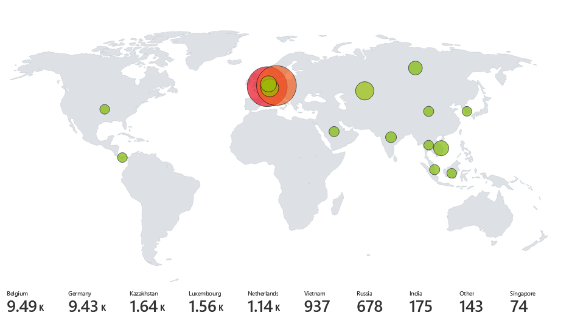

<!--more-->
## Intro

In Azure, I create a honey pot VM (Virtual Machine) that exposed to the Internet, and above is the map that virtualize the Remote Desktop brute-force from all over the world in about 2 days.


Here is an overview of how to implement this

- Create VM that expose to Internet
  - Use **Powershell** script to extract information such as `ip, username` from **Event Viewer**
  - Use third-part API (Here I choose: ipgeolocation.io) to retrieve geolocation such as `country`, `latitute` of attacker's `ip`, and integrate all the necessary logs into a **local log file**
- Create `custom log` using Log Analytics Workspaces** 
  - Read from our **local log file** 
  - Extract certain `fields` such as country, geolocation, username, ip
  - Manually train the data fields extraction model to ensure all fields are correctly extracted from the log file
- Create new `workbook` using Azure Sentinel** 
  - Query data from our custom log using **KQL** (Kusto query language)
  - Plot the world map using the data

## Create VM that expose to Internet

We need the credential to RDP (remote desktop) to this VM, do remember them

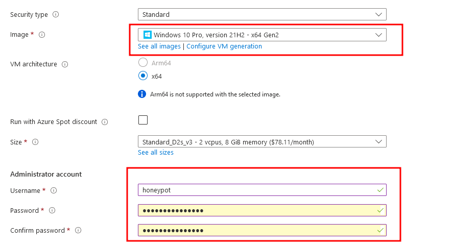

Create new security group to allow all ports exposed to internet

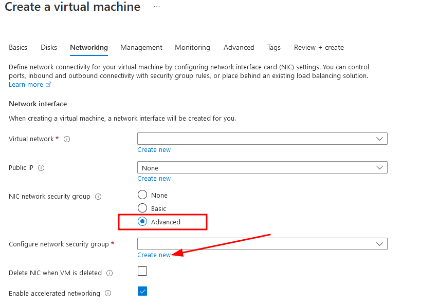

Change the port range to `*`, which means all ports

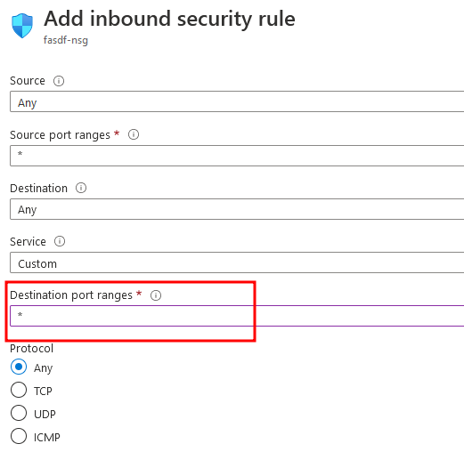

Before the VM boot up, we need to turn on some setting in **Microsoft Defender for Cloud**

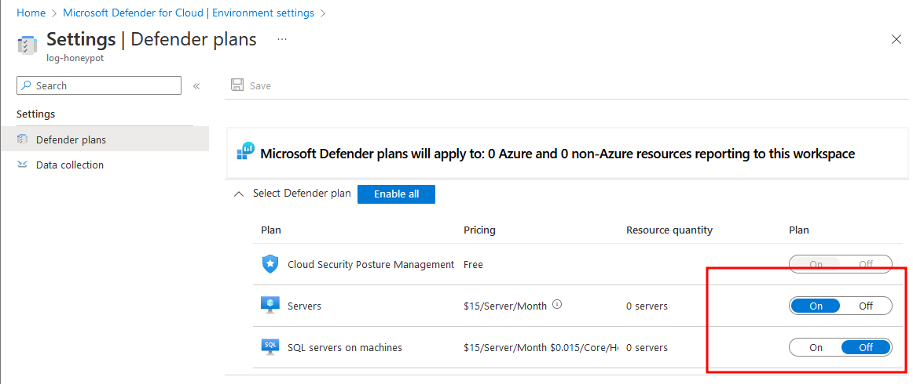

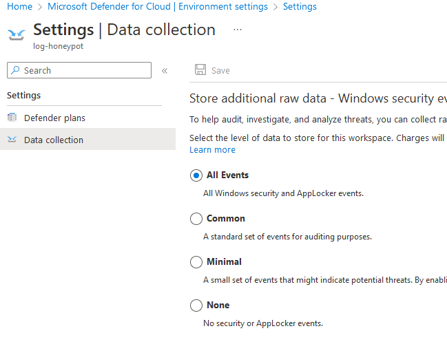

After all completed, wait a few mins and we can see our VM has been created along with its **public IP**, let's RDP into it

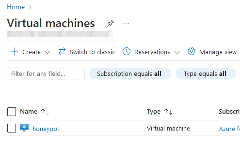

For windows, there's a default RDP software for us, however, if you're on Mac or Linux, you need to install some RDP software 

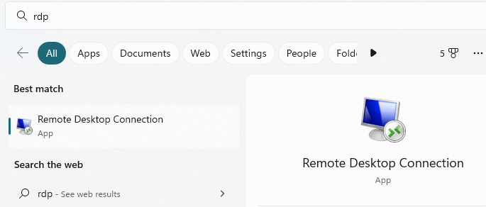

First thing to do after login, we need to **turn off the all firewalls** of windows defender, here's how I do it

1. type wf.msc in windows bottom search bar
2. open `windows defender firewall policy`
3. turn all firewall state to off

- Use **Powershell** script to extract information such as `ip, username` from **Event Viewer**

Windows has build-in logs where stores failed rdp logins and other security logs, you can see them in **Event viewer**

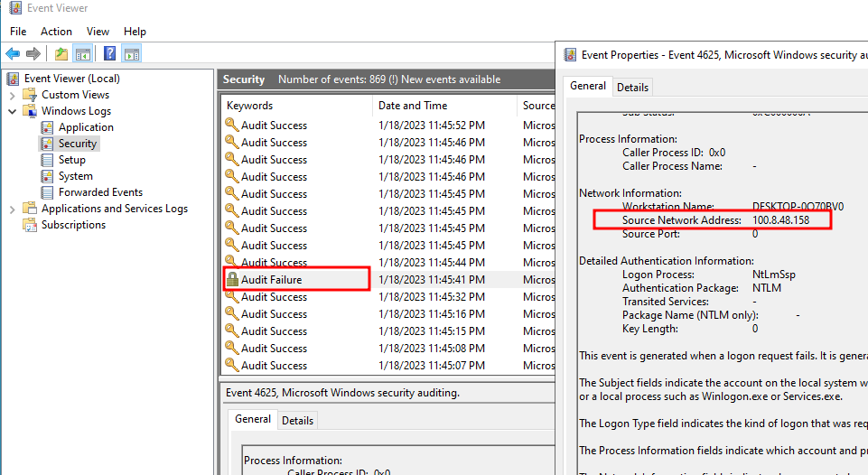

However, there's no geolocation of the `ip`, so I need to use a third part API (ipgeolocation.io). Here is the overview of the [script](https://github.com/joshmadakor1/Sentinel-Lab/blob/main/Custom_Security_Log_Exporter.ps1)

> make sure to change the api token

1. Use powershell to send the attacker's `ip` to the API

2. Get geolocation from the API, extract useful info from the json response

3. Integrate them into a local log file (C:\ProgramData\failed_rdp.log)

After running the script in powershell ISE (built-in powershell IDE), the failed rdp attempt will be shown in console

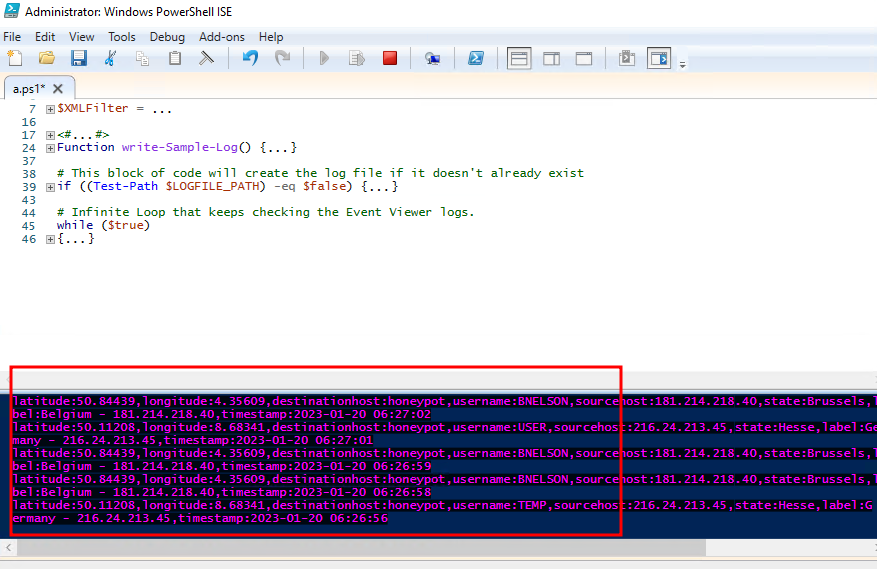

The log file will be created as well

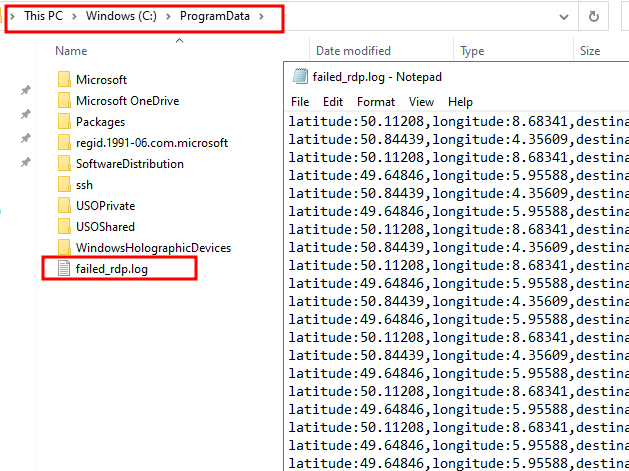

In first few hours, there may no output in the console because attackers haven't discover your ip yet, so you can fail the RDP to your VM manually to test if the script is running correctly.

## Create custom log using Log Analytics Workspaces

- Create Log Analytic workspace, go to **Log Analytic workspace** and create a new one

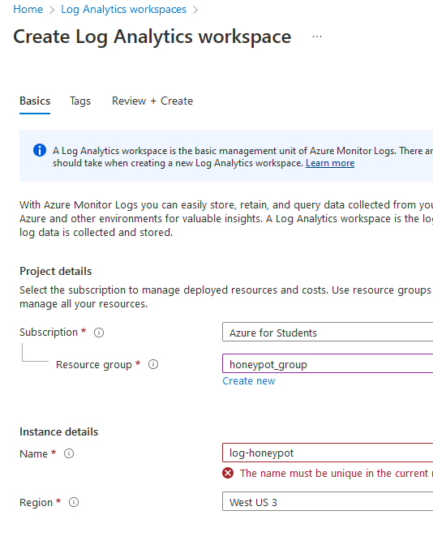

- Add custom log

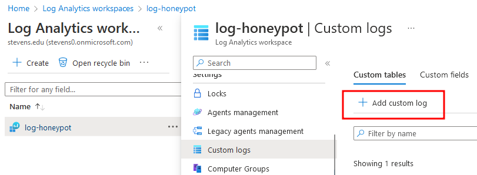

This step is to create a custom query so that the azure **Log workspace** will query data from our local log file, here's the step to create a **custom log**

1. Select a sample file, you can copy paste the content of the log file from VM into your host machine as a sample file

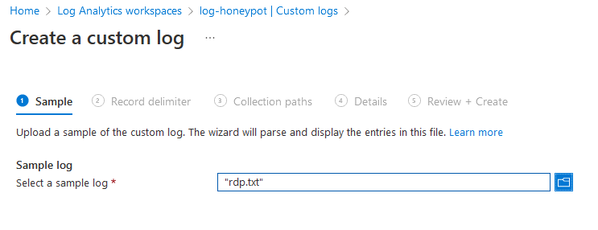

2. Specify the file location

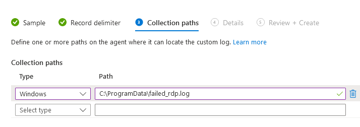

3. Specify the custom log name

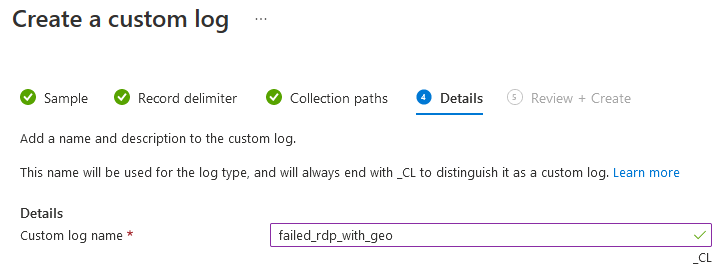

4. After your completed, you should verify that by type your custom log name, and it will have auto-suggestion in the **log query**

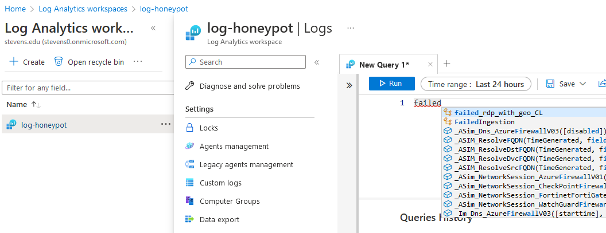

Although we have our custom log query, it only reads the text per line as output, we need to create custom field to extract certain info such as: `username`, `ip`, `country`. To do that, we wait few mins so that the `failed_rdp_with_geo_CL` will have output after running, and then `extract fileds from it`

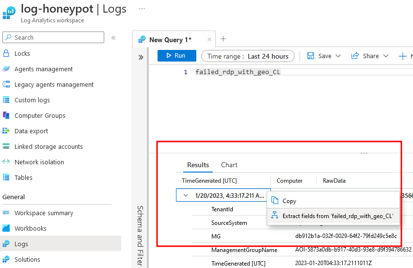

To extract certain fields, we need to highlight the certain field we want to extract, and specify the `field name` and the `data type`

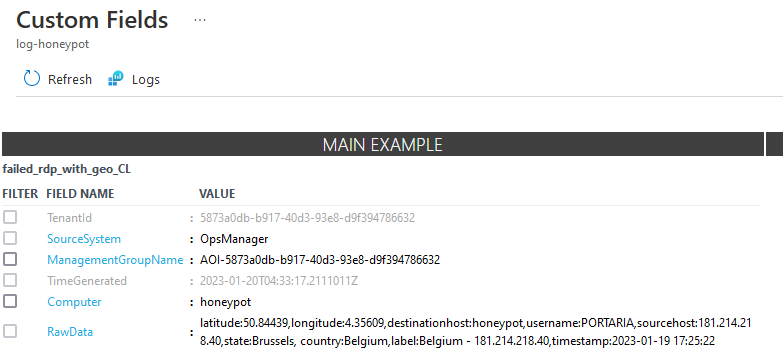

For example, to create a username filed, which is a type of text.

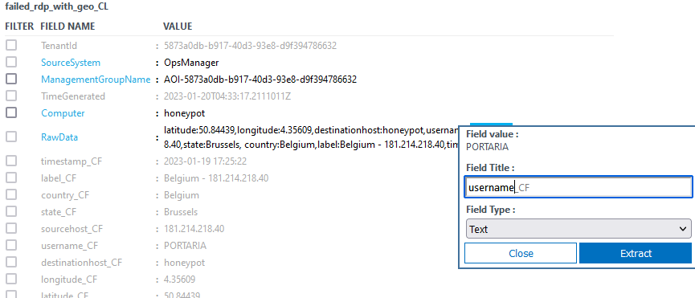

After creating the fields, don't forget to manually check if the extraction is done correctly, if certain field you see has been incorrectly extracted, manually go to that result and highlight the certain field again until all **search results** are correct

## Create new workbook using Azure Sentinel

First you need to create a new **Azure sentine**l which connects to the **Log workspace** we just created

Then we will create a new **workbook** which will be our **SIEM**

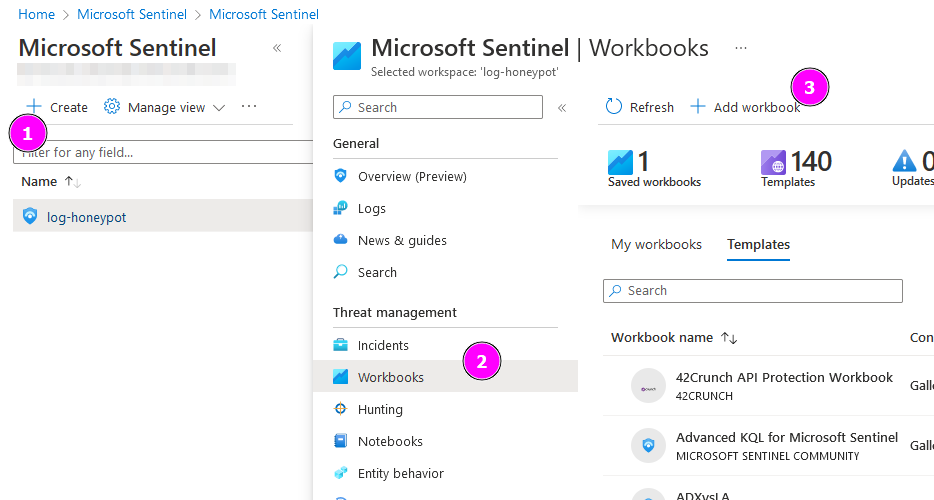

To Create our **workbook**, we need to **delete all default one** and **add a new query**, then type following query and run to see the results

```
failed_rdp_with_geo_CL | summarize event_count=count() by sourcehost_CF, latitude_CF, longitude_CF, country_CF, label_CF, destinationhost_CF
| where destinationhost_CF != "samplehost"
| where sourcehost_CF != ""
```

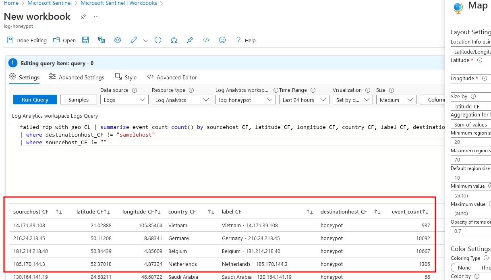

You can see we have successfully query the fields we want, and next is to plot the map.

Change the `Visualization` to `map`, and change the map settings in the right sidebar as following

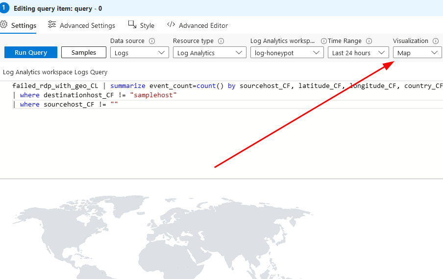

You can change the `location info using` to `latitude/longitude`, however, I prefer using `Country or region`， then click `apply` and  `save and close`, all settings are done

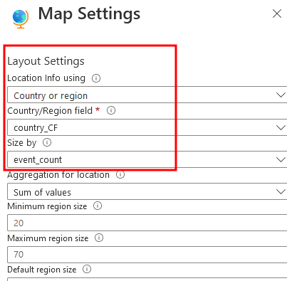

In the end, wait a couple of hours, you will see the attacks happen from the powershell console, and refresh the workbook, you will find it will show something like following

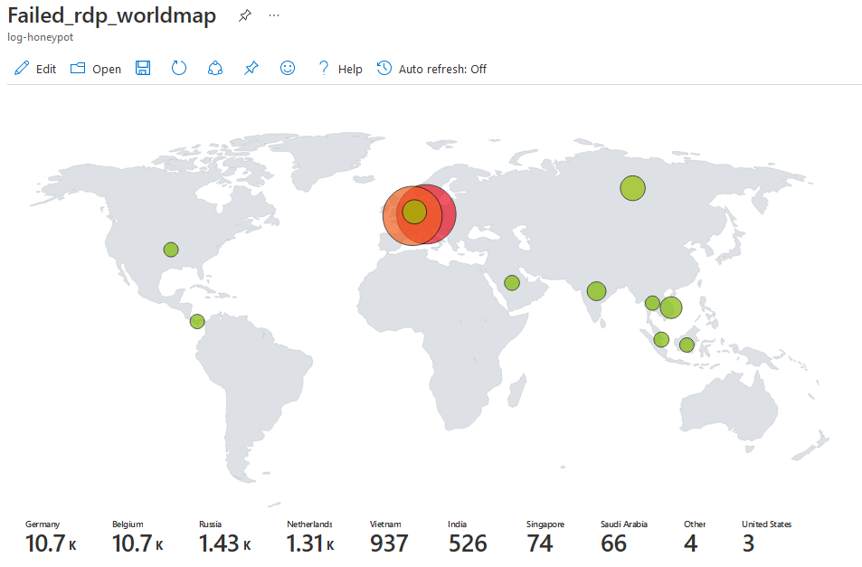

## Summary

In this process, I learned process of creating a SIEM, how to extract logs from windows, and the usage of multiple Azure functions, as well as how to trouble shoot all the tiny problems I encountered.

A big thanks to [Josh](https://www.youtube.com/@JoshMadakor) who created this SIEM tutorial and gave out many helpful videos which related to me, check him out if you like.


