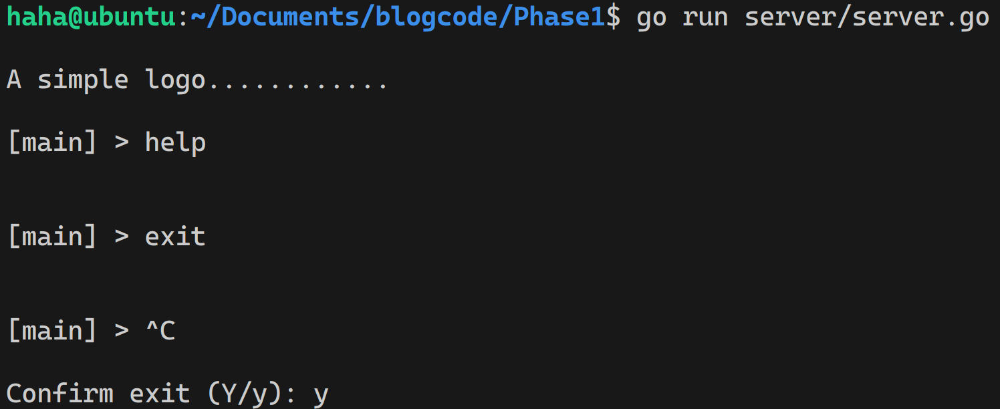
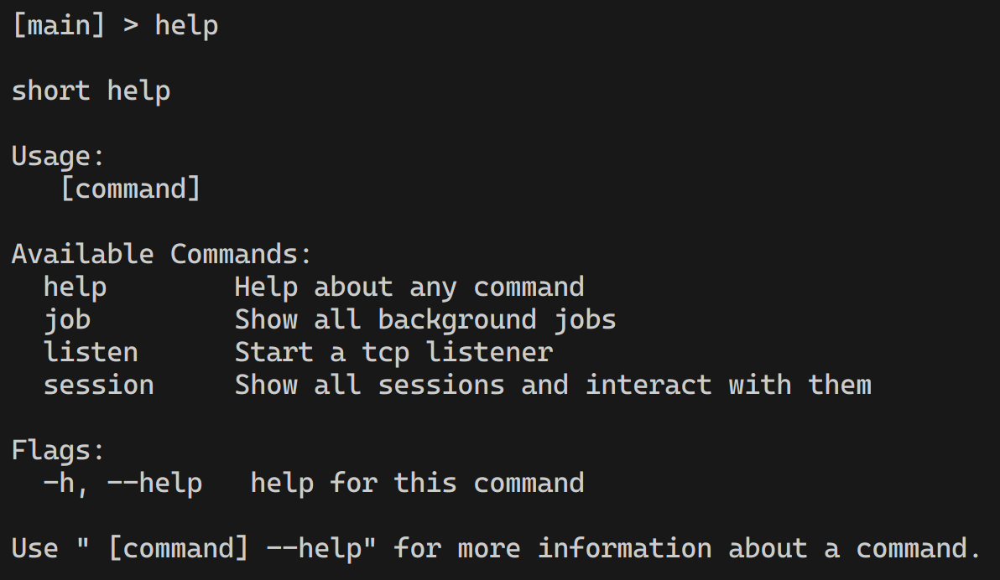
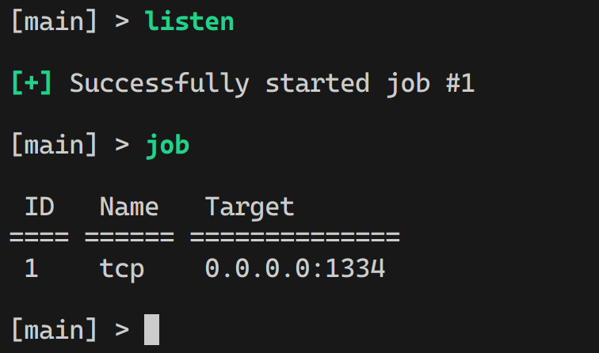
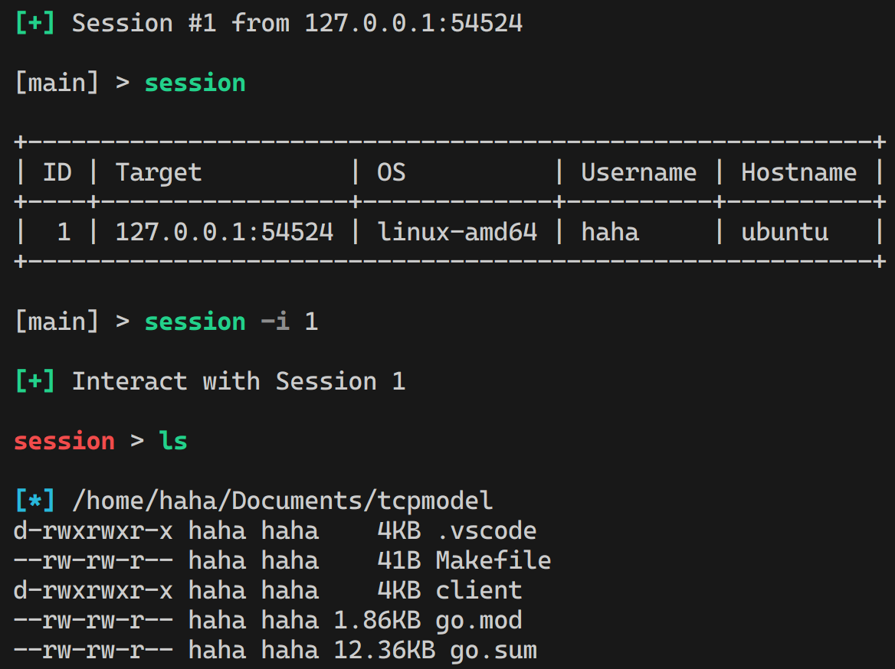

> This blog is for educational purpose only

Code repo for this blog: https://github.com/3santree/blogcode

## Phase 1

We will use [console](https://github.com/reeflective/console) library which aslo used by [Sliver](https://github.com/BishopFox/sliver). I recommand  go through the example it provides in the repo to get familiar with its usage, because I won't explain setting up console in detail.


```textile
Phase1
├── go.mod
├── go.sum
└── server
    ├── console
    │   ├── console.go
    └── server.go
```

`server/server.go` is the main function that will use packages inside folder `server`

```go
package main

import "blogcode/server/console"

func main() {
    console.Con.App.Start()
}
```

The program will be look like this, no help menu as we haven't add any commands yet. To exit the program, use `Ctrl-C` and type `y` to confirm exit

> To save spaces for the blog, I put the code into github for you to test and play, for first time running, do `go mod tidy` in every folder to sync dependenies.

<p align="center">

</p>

## Phase 2

<p align="center">

</p>

Now we need to add commands to this program, here're the some functionality we gonna build:

- `listen`: start a tcp listener that waiting for connection, you can specify the `ip` and `port`, a listener will be add to job queue

- `job`: print all background job

<p align="center">

</p>

- `session`: print all sessions (along with the ip, os, username, hostname). You can interact will a session if you specify the session id after `-i`

<p align="center">

</p>

### listen

Let's understand `server/listen.go` code logic fisrt, which is called when we type `listen` in the console. `listen()` called in `server/command,go`

```go
listen := &cobra.Command{
    Use:   "listen",
    Short: "Start a tcp listener",
    Run: func(cmd *cobra.Command, args []string) {
        h, _ := cmd.Flags().GetIP("lhost")
        p, _ := cmd.Flags().GetUint32("lport")
        // listen on port p, host h
        listen(h, p)
    },
}
```

Dive into `listen.go` where it's implemented, it only do two things where the function name can explain for themselves

```go
func listen(ip net.IP, port uint32) {
    tcpListen(ip, port)
    addJob(ip, port, "tcp")
}
```

For `tcpListen`, it does following things

1. Start listener `ln`  on `ip:port`, accept the connection in the **background** which is `go acceptConnections(ln))`

2. `acceptConnections()` will send the established connection to `handleConncetion()` which implements the classic tcp read/write functionality

3. `handleConncetion()` will read the incoming data in the background, everytime we read some data, we will pass it to `Send loop`, where the  `msgHandler()` will decide what to do based on the data we recevied

4. In `msgHandler()`, I use the `type` to differentiate the message

```go
switch env.Type {
    // heartbeat
    case 0:
    // command's response, print out to console
    case 1:
    // Receive session info {os, username, hostname}
    case 2:
}
```

I use protobuf to package each message, you can find how I define a message structure in `pb/message.proto`. 

```protobuf
message Envelope {
    int64 ID = 1;   // Envelope ID used to track request/response
    uint32 Type = 2; // Message type
    bytes Data = 3;  // Actual message data
  
    bool UnknownMessageType = 4; // Set if the implant did not understand the message
}

message SessionInfo {
    int32 ID = 1;
    string  System = 2;
    string  Username = 3;
    string  Hostname = 4;
}
```

For example, if we receive an response that client send to us, contains the `message SessionInfo`, we can unpack it and get the value which is what I do in `case 2` of `msfHandler()`

```go
case 2:
    data := env.GetData()
    info := &pb.SessionInfo{}
    // Unmarshel the protobuf to variable data
    err = proto.Unmarshal(data, info)
    if err != nil {
        fmt.Printf("Un-marshaling envelope error: %v\n", err)
    }
    // Get all the value
    session.System = info.GetSystem()
    session.Hostname = info.GetHostname()
    session.Username = info.GetUsername()
```

### session

In `session.go`, if you want to interact with a session, it will switch to session menu for more action, such as `ls()` to list current directory of the client. Other will print all sessions

```go
func session(k, i int) {
    if i != 0 {
        PrintSuccess("Interact with Session %d\n", i)
        console.Con.SessionAct = i
        // Interact with a session, switch menu prompt
        console.Con.App.SwitchMenu("session")
        return
    }
    // kill or print sessions
    if k == 0 {
        printSessions()
    } else {
        if session, ok := console.Con.Sessions[k]; ok {
            session.SessionCtrl <- true
        } else {
            PrintError("session %d not exist\n", k)
        }
    }
}
```

After switching to the session's menu, the command is implemented by `SessionCmd()` in `server/command.go`

```go
bgCmd := &cobra.Command{
    Use:   "bg",
        Short: "back to main menu (Ctrl-D)",
        Run: func(cmd *cobra.Command, args []string) {
            PrintInfo("Switch back to main menu\n")
            con.Con.SessionAct = 0
            con.Con.App.SwitchMenu("")
        },
    }
    rootCmd.AddCommand(bgCmd)

    lsCmd := &cobra.Command{
        Use:   "ls",
        Short: "list directory content",
        Run: func(cmd *cobra.Command, args []string) {
            ls()
        },
    }
    rootCmd.AddCommand(lsCmd)
```

The `ls()` implemented in `server/commands/ls.go` is as an example of how to send command to the server. When the client recieves server's message

- It checks the type is `1` meaning it's an command from server
- Read the Data which indicates the command `ls` , then prepare the output of `ls` 
- Send the output back to server using type `1`, the server's `msfHandler()` recognize it as client's response and print out the response


```go
func ls() {
    conn := console.Con.Sessions[console.Con.SessionAct].Conn
    // Prepare protobuf message, type 1 shows this is a command from server
    req := &pb.Envelope{
        ID:   1,
        Type: 1,
        Data: []byte("ls"),
    }
    // Send message to client
    err := WriteEnvelope(conn, req)
    if err != nil {
        PrintError("ls Error\n")
    }
    <-console.Con.PrintWait
}

```

## Phase 3

We add the client's code which has following structure

```
.
├── client.go       // connect to server, message handler
└── cmds
    └── ls.go       // implement Ls() called by handler
```

For `client.go`, the code logic is similar to `server/listen.go`

1. Connect to a `ip:port` by `client()`
2. `client()` implement tcp read/write model and send any recieved message to `clientHandler()`
3. `clientHandler()` is similar to `msgHandler()` in the server, which will make the action based on different message type, where case `1` indicates the command from server

```go
// cmd Message
case 1:
    fmt.Printf("[%s] %s\n", conn.RemoteAddr(), env.GetData())
    switch string(env.GetData()) {
    case "ls":
        cmds.Ls(conn)
    }
```

## Final

Here's what's we implemented so far looks like. for `ls()` now it's only works for linux, anyway, we know the basic flow of the sending commands and get result back. Now We can build more functionality upon this rather than in part 1!

[](https://asciinema.org/a/lRN9lnUTzGq20YQN7r9AppALQ)

## Reference

> - https://github.com/BishopFox/sliver.git
> - https://github.com/moloch--/gshell.git
> - https://blog.kowalczyk.info/article/wOYk/advanced-command-execution-in-go-with-osexec.html
> - https://github.com/reeflective/console


