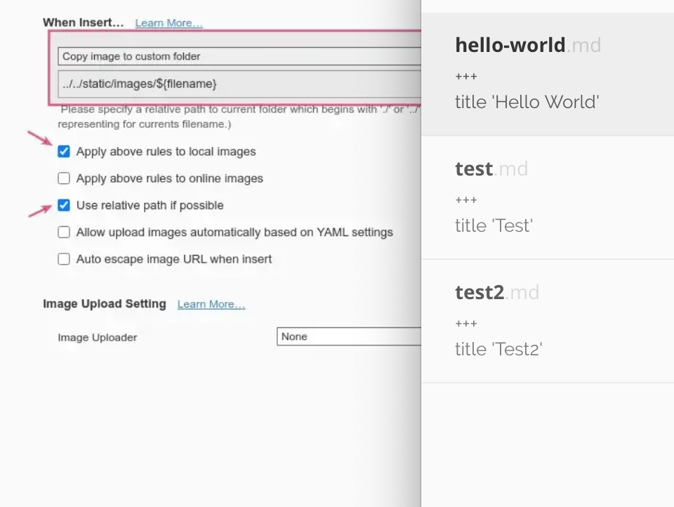

+++

title = 'Hello World'
date = 2020-09-10T19:06:49+08:00
draft = false
categories = ['hello']
tags = ['hello world']
comment = false

+++

Hello world! :tada:

<!--more-->

# h1
## h2
### h3
#### h4

- point1
    - point1-1
    - point1-2
- point2
- point3

1. list1
    1. list1-1
    2. list1-2
    3. list1-3
2. list2

```python
code
```


{}
world
{}

{}
world
{}

{}
hello world
{}

## 图片


