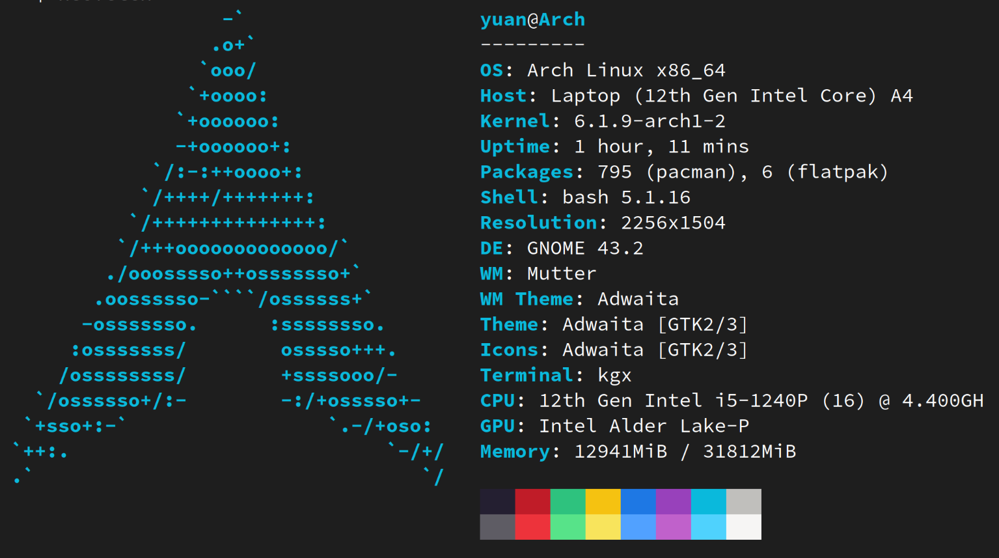

+++
title = 'Troubleshoot linux on framework laptop'
date = 2023-02-08T15:47:22-05:00
draft = false
categories = ['Linux']
tags = ['arch', 'framework laptop']
comment = false
+++

# 旧的不去，新的不来

> New one comes, after the old one's gone". 



<!--more-->

# Old one

After my 2015 macbook pro broken, I need a new laptop, which I have a list of specific requirements on that.

1. Around \\$1000.
2. Can upgrade ssd, ram, etc.
3. No need for gpu, I don't game anymore.
4. Premuim look, minimal, with good screen.

# New one

After a long time of consideration, I found one I really like: **Framework Laptop** . Despite my friend thought it's not worth the money, comparing to the laptops that have very powerful GPU. I'm very happy I follow my own thoughts and been happy with the framework laptop since I got it. Here's why

1. 14 inch with a beautiful 3:2 screen, perfect enough for me.
2. DIY edition for \\$815 , I bought the rest my own, such as 32gb ram, charger... If you want a good 32gb laptop on nowadays market, you probably have to go beyond \\$1300.
3. Fully upgradable! You can disassemble anything on this computer, ram, ssd, keyboard, camera, even the motherboard! Which really gives you a feeling that this laptop is owned by you, you are fully controllable on this beautiful yet powerful beast.
4. It supports multiple **Linux systems**.

# Problems after install linux

Using linux is cool, however, it's not supported the same way as windows, which means you have to troubleshoot things for yourself, software, hardware, configuration, anything. Here's a list of problem I encountered after a brand new install of Arch linux with gnome as Desktop Environment.

## F7/F8 brightness control not working

Reboot after creating the file, then it works

```bash
sudo echo "blacklist hid_sensor_hub" > /etc/modprobe.d/framework-als-blacklist.conf
```

## School's wifi

I've seen many same feedbacks from internet, to connect their university's wifi on linux, you need to donwload an binary called `SecureW2.run`. After running it, it will open your brower for you to login to your organization, so that the program can capture your credential and verify your identity. 

However, there's no browser poping up...

You need to install `gnome-browser-connector` for gnome, to enable the program open your browser.

## Blurry look for installed software

It happens for `firefox`, `vscode` in my case. I assume it will be more software that has the issue. To solve this, you need to tell the program: "Hey! use wayland as display server", because they default didn't use wayland, which is default for gnome, as they display their GUI.

To do that, you need to find the specifc `.desktop` file in folder `/usr/share/applications`, which is configuration of what the system gonna do after you click the desktop icon.

For example for `firefox`: 
1. Edit `/usr/share/applications/firefox.desktop`
2. Find `Exec=...` line, which is the command it will run
3. Change it to `EXEC=MOZ_ENABLE_WAYLAND=1...`, (This is firefox specific, for others, I suggest to find the solution on arch wiki)

## Chinese support

Reference: https://wiki.archlinux.org/title/Localization/Simplified_Chinese

0. Add your language in locale. (I've done it during the installation) 
1. To display Chinese characters, I installed font pkg `wqy-zenhei` from the list
2. Install Chinese input method, install `ibus, ibus-rime`

## A annoying problem that cost me 2 days...

Testing my 3.5mm jack headset on the laptop, it recognized the speaker, but not the microphone.

I tried almost all solution I could find on internet, no one works. It do have microphone on it, I've used it on my macbook before!

So what's going on? I plug another headset I have, suprisingly, the computer recognize the microphone! how so! It turns out the headphone cable have different versions. The one didn't work is 3-pole, which have only speaker. The one works is 4-pole, which has both speaker and mic on that...

That's the part where Macbook could get people annoyed, Although I like it very much.


  
